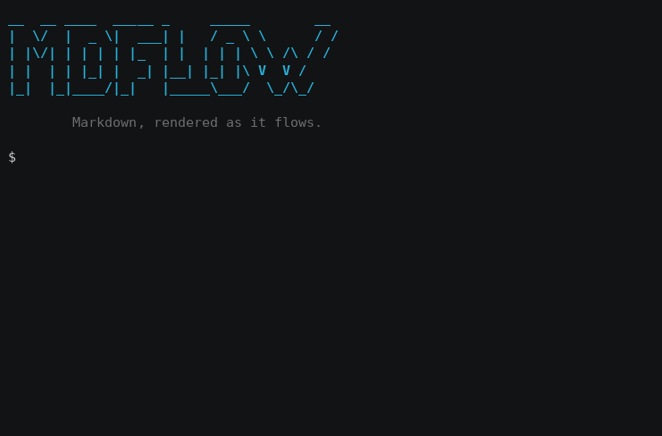

# mdflow

> #### mdflow is a small, fast, true 〰️streaming〰️ Markdown-to-terminal renderer
>
> *Parser derived from the proven [MD4C](https://github.com/mity/md4c), restructured for true streaming.*

### See it in action



---

## Why mdflow

- **Real-time Streaming** - must have for AI
- **CommonMark + GFM support tested** - tested against the CommonMark specification (652 examples)
- **Very Fast**
- **Flat memory** - use little memory and stays flat as input grows
- **Lightweight** - tiny binary easy to embed in an app or resource-constrained devices

### Comparison

|             |             | <ins> mdflow </ins> | streamdown | mdcat | glow (glamour) |  
| :---------- | :---------- | :-----------------: | :--------: | :---: | :-------------: |  
| Capabilities | Streaming | ✅ | ✅ | ❌ | ❌ |  
|              | Buffering | Single line | Single line | Whole doc | Whole doc |  
|              | CommonMark | ✅ Tested* | ❌ | ✅ Tested | ❌ |
|              | GFM tables | ✅ | ⚠️ Limited | ⚠️ Limited | ✅ |  
| Render time  | 1 MB input | $\color{green}{\mathsf{0.05\ s}}$ | $\mathsf{8.09\ s}$ | $\mathsf{0.34\ s}$ | $\mathsf{0.64\ s}$ |  
|              | 10 MB input | $\color{green}{\mathsf{0.57\ s}}$ | $\mathsf{78.72\ s}$ | $\mathsf{2.85\ s}$ | $\mathsf{12.33\ s}$ |  
|              | 100 MB input | $\color{green}{\mathsf{5.68\ s}}$ | — | $\mathsf{27.38\ s}$ | — |  
| Peak RAM     | 1 MB input | $\color{green}{\mathsf{2.2\ MB}}$ | $\mathsf{24.8\ MB}$ | $\mathsf{48.7\ MB}$ | $\mathsf{118.3\ MB}$ |  
|              | 10 MB input | $\color{green}{\mathsf{2.3\ MB}}$ | $\mathsf{24.8\ MB}$ | $\mathsf{102.3\ MB}$ | $\mathsf{972.8\ MB}$ |  
|              | 100 MB input | $\color{green}{\mathsf{2.2\ MB}}$ | — | $\mathsf{624.6\ MB}$ | — |  
| Binary       | Language | C | Python | Rust | Go |  
|              | Size | $\color{green}{\mathsf{301.2\ KB}}$ | — | $\mathsf{11.0\ MB}$ | $\mathsf{17.2\ MB}$ |

<sub>1. See "CommonMark + GFM support, extensions, and limitations" for tested coverage and known differences.</sub><br>
<sub>2. streamdown and glow did not finish the 100 MB test within 100 seconds.</sub><br>
<sub>3. Input consisted of mixed Markdown. Performance varies by content.</sub><br>
<sub>4. Benchmarked on GitHub Actions (Ubuntu 24.04, AMD EPYC 7763, 4 vCPUs)</sub><br>
<sub>5. mdflow v0.1.1, streamdown 0.36.6, glow v2.1.2, and mdcat v2.7.1.</sub>

---

## Features

- **CommonMark + GFM support** - tables, strikethrough, task lists, autolinks, footnotes, and admonitions, with known differences and streaming limitations documented below.
- **Extras on top** - highlights.
- **Tables** - box-drawing borders, alignment, automatic layout, and wrapping that preserves styling.
- **Unicode-correct** - tested with CJK and emoji.
- **Syntax highlighting** - simplified, generic highlighting using five styles, applied  to code blocks of major programming language.
- **Inline HTML** - tags and entities styled for the terminal, with comments hidden.
- **HTML blocks** - raw HTML scanned and styled, entities decoded, comments hidden, and Markdown inside left literal.
- **Clickable links** - links, autolinks, and emails are OSC 8 terminal hyperlinks; `--osc8-off` shows URLs for terminals without hyperlink support.

### CommonMark + GFM support, extensions, and limitations

This section describes mdflow's current level of Markdown support and its known differences. It is not a claim of full conformance. CommonMark and GFM define expected HTML output in their examples. This section only addresses the parser, not mdflow's ANSI renderer and its terminal presentation.

mdflow is tested against all 652 CommonMark specification examples and against the GFM features listed above. The complete example set is included in testing. MD4C is fully CommonMark-compliant; mdflow's parser produces identical output to MD4C on all examples except those involving a limitation documented below.

### Streaming limitations

A proper live Markdown generator already avoids features that depend on future input. In static documents, the practical impact remains small.

#### Could match with additional buffering, but mdflow chooses not to

| Feature | mdflow behavior | Practical impact |
| :------ | :-------------- | :--------------- |
| Tight/loose lists | The first list item may retain tight. | No visible difference in the terminal. |
| Multi-line Setext headings | Only the last line becomes a heading. | Affects only uncommon multi-line Setext headings. |

#### Cannot be fully streamed

| Feature | mdflow behavior | Practical impact |
| :------ | :-------------- | :--------------- |
| Reference links | Reference shown immediately without resolving definition, and definitions appear at the end. | Rare in live Markdown. No content is lost. |
| Footnotes | Footnote Reference shown immediately without validating definition. | Rare in live Markdown. No content is lost. |

### Other notes

- **Syntax highlighting** - current highlighting is lightweight and generic, rather than language-specific.
- **No pager or TUI** - mdflow renders; scrolling is left to `more` or `less -R`.
- **Customization** - user-facing theme configuration and additional on/off feature flags are not currently exposed.

---

## Install

For Linux and macOS, installs to `~/.local/bin`:

```sh
curl -fsSL https://raw.githubusercontent.com/cjccjj/mdflow/main/install.sh | sh
```

Or download a binary from [Releases](https://github.com/cjccjj/mdflow/releases) (Linux x86_64/arm64, macOS arm64).

---

## Use

Pipe Markdown into mdflow - logs, files, LLM output, anything that streams:

```sh
cat README.md | mdflow
llm "show me a markdown demo" | mdflow
```

Or read a file with a redirect (mdflow takes stdin only, no filename arguments):

```sh
mdflow < README.md
```

For paging long documents, pipe to `more` or `less -R` - they render ANSI colors and stream input as it arrives. Plain `less` shows raw escape codes.

```sh
mdflow < README.md | more
```

Typewriter (paced) output is on only when live streams are detected, making the output appear smoother. It adds no delay before the first character appears, and may add a total delay during streaming less than 1 second.

Typewriter mode will not be on for non-live-stream input and can be forcibly disabled with:

```bash
--typewriter-off
```

OSC 8 hyperlinks are on by default. For Apple Terminal and other terminals that do not support OSC8, turn it off with:

```bash
--osc8-off
```

---

## Development

### Library

mdflow is also a small C library - three functions, libc only:

```c
#include "mdflow.h"

mdflow_t* mf = mdflow_open(80, my_output_callback, my_userdata);
mdflow_write(mf, "# Hello\n", 8);
mdflow_close(mf);
```

`mdflow_open()` takes a terminal width (0 = unlimited), an output callback, and userdata.  
Feed chunks with `mdflow_write()` - styled output arrives through the callback as blocks close. `mdflow_close()` flushes and frees everything. Link with `-lmdflow`.

### Build

```sh
cmake -S . -B build
cmake --build build
```

Building requires only a C compiler and CMake. GCC and Clang builds enable `-Wall`, `-Wextra`, and `-Wshadow`.

### Architecture

```text
stdin → parser (streaming) → renderer (streaming) → stdout
```

Two components, both streaming, bundled into one library - no AST, no document buffer.

**Parser (MD4CS)** - [MD4C](https://github.com/mity/md4c) is a fast SAX-like Markdown parser with a flat-buffer design, though it still buffers in full and fires all callbacks at the end, because many features depend on input that has not arrived yet.  
When analyzed feature by feature, some require only one line of lookahead; some require unbounded lookahead but style can be determined earlier. mdflow's parser MD4CS, builds on top of MD4C, reconstructs the features that require handling to enable true streaming. It can thus emit callbacks in the first pass and free memory immediately.

**Renderer (md4cs-ansi)** - maps parser callbacks to styled terminal output.

**Sub-modules:**

- `highlight.c` - single-pass lightweight code highlighting, derived from [microlight](https://github.com/asvd/microlight) (MIT)
- `html.c` - HTML tag/entity scanner that styles raw HTML
- tables - box-drawing layout that redraws when column widths change mid-stream

### Acknowledgments

- [MD4C](https://github.com/mity/md4c) by Martin Mitáš (MIT) - the parser mdflow is built on.
- [microlight](https://github.com/asvd/microlight) by asvd (MIT) - the code highlighter is derived from it.

### License

MIT. See [LICENSE.md](LICENSE.md) and the license comments in the source file headers.
